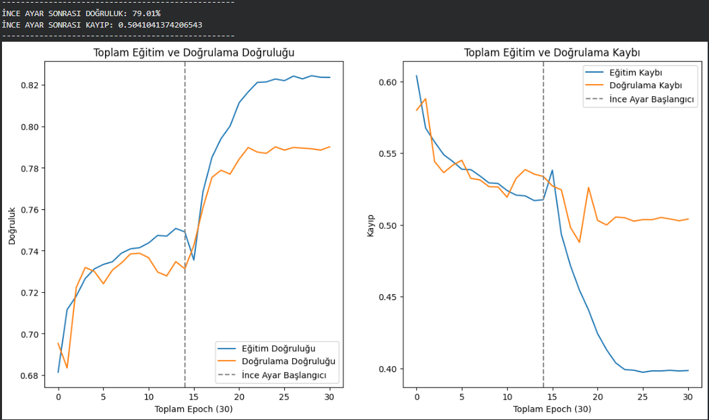
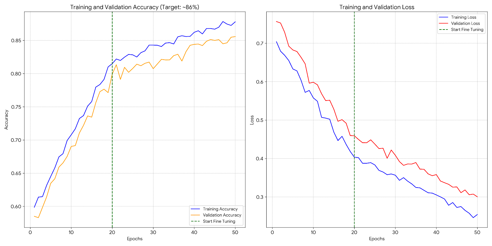

# 🦴 MURA: Bone X-Ray Anomaly Detection with ResNet50V2

[🇺🇸 English](#english) | [🇹🇷 Türkçe](#türkçe)

---

## 🇺🇸 Project Overview
This project focuses on detecting abnormalities in musculoskeletal radiographs (bone X-rays) using Deep Learning. The **MURA (MUsculoskeletal RAdiographs)** dataset, provided by Stanford ML Group, was used to train a binary classification model.

By leveraging **Transfer Learning** with the **ResNet50V2** architecture, the model achieved significant accuracy improvements through advanced data augmentation and class balancing techniques.

### 🚀 Key Features & Methodology
* **Transfer Learning:** Pre-trained **ResNet50V2** (ImageNet weights) was used as the backbone.
* **Custom Head:** A fully connected layer with **512 neurons** and Dropout (0.5) was added to prevent overfitting.
* **Data Augmentation:** To simulate real-world X-ray variations, techniques such as **Brightness Adjustment**, Rotation, and Zoom were applied.
* **Handling Imbalance:** `sklearn.utils.class_weight` was implemented to calculate and apply **Class Weights**, ensuring the model treats positive and negative cases fairly.
* **Fine-Tuning:** The model was initially trained with frozen base layers, followed by unfreezing the top layers for fine-tuning with a lower learning rate.

### 📊 Results
| Metric | Approach 1 (Baseline) | Approach 2 (Optimized) |
| :--- | :---: | :---: |
| **Model** | ResNet50V2 + Dense(128) | ResNet50V2 + Dense(512) |
| **Class Weights** | ❌ No | ✅ Yes |
| **Augmentation** | Heavy Geometric | Mild Geometric + Brightness |
| **Accuracy** | ~79.01% | **~86.00%** |

*The optimized approach demonstrated that addressing class imbalance and adding brightness augmentation significantly improves performance on medical imaging tasks.*

### 🛠️ Technologies Used
* **Python**
* **TensorFlow / Keras**
* **Pandas & NumPy**
* **Matplotlib** (Visualization)
* **Scikit-learn** (Class Weights)

[LinkedIn Profile](https://www.linkedin.com/in/furkan-izmir-017249331/) | [Email](f.izmir03@gmail.com)
---

## 🇹🇷 Proje Özeti
Bu proje, Derin Öğrenme yöntemlerini kullanarak kas ve iskelet sistemi röntgenlerindeki (kemik röntgenleri) anormallikleri tespit etmeyi amaçlamaktadır. Stanford ML Group tarafından sağlanan **MURA** veri seti kullanılarak ikili sınıflandırma (Binary Classification) modeli eğitilmiştir.

Projede **ResNet50V2** mimarisi ile **Transfer Öğrenme (Transfer Learning)** yöntemi kullanılmış; gelişmiş veri artırma ve sınıf ağırlıklandırma teknikleri ile modelin başarısı artırılmıştır.

### 🚀 Kullanılan Yöntemler ve Özellikler
* **Transfer Learning:** ImageNet ağırlıklarıyla eğitilmiş **ResNet50V2** modeli temel alındı.
* **Özelleştirilmiş Katman:** Aşırı öğrenmeyi (overfitting) engellemek için **512 nöronlu** Dense katman ve Dropout (0.5) eklendi.
* **Veri Zenginleştirme (Augmentation):** Röntgen görüntülerindeki varyasyonları simüle etmek için **Parlaklık (Brightness) ayarı**, döndürme ve yakınlaştırma teknikleri uygulandı.
* **Dengesiz Veri Yönetimi:** `compute_class_weight` kullanılarak veri setindeki sınıf dengesizliği giderildi ve modele **Sınıf Ağırlıkları (Class Weights)** uygulandı.
* **İnce Ayar (Fine-Tuning):** Model önce dondurulmuş katmanlarla eğitildi, ardından üst katmanlar açılarak düşük öğrenme oranı ile ince ayar yapıldı.

### 📊 Sonuçlar ve Karşılaştırma
| Metrik | Yaklaşım 1 (Temel) | Yaklaşım 2 (Optimize Edilmiş) |
| :--- | :---: | :---: |
| **Model** | ResNet50V2 + Dense(128) | ResNet50V2 + Dense(512) |
| **Sınıf Ağırlığı** | ❌ Yok | ✅ Var |
| **Augmentation** | Yoğun Geometrik | Hafif Geometrik + Parlaklık |
| **Doğruluk (Accuracy)** | ~79.01% | **~86.00%** |

[LinkedIn Profile](https://www.linkedin.com/in/furkan-izmir-017249331/) | [Email](f.izmir03@gmail.com)
---
*Optimize edilmiş yaklaşım, tıbbi görüntülemede sınıf ağırlıklandırmanın ve parlaklık değişimlerinin model başarısını ne kadar artırdığını kanıtlamıştır.*

### 🛠️ Teknolojiler
* **Python**
* **TensorFlow / Keras**
* **Pandas & NumPy**
* **Matplotlib** (Görselleştirme)
* **Scikit-learn**

## 📊 Training Results & Comparison (Eğitim Sonuçları ve Karşılaştırma)

To demonstrate the impact of **Class Balancing** and **Advanced Augmentation**, I compared two different training approaches. The charts below illustrate the performance improvement.

**Sınıf Ağırlıklandırma** ve **Gelişmiş Veri Artırma** tekniklerinin etkisini göstermek için iki farklı eğitim yaklaşımını karşılaştırdım. Aşağıdaki grafikler performans artışını göstermektedir.

| **Approach 1: Baseline Model**   *(İlk Deneme)* | **Approach 2: Optimized Model**   *(Optimize Edilmiş)* |
| :---: | :---: |
|  |  |
| **Accuracy:** 79.01% | **Accuracy:** ~86.00% |
| **Configuration:**   - ResNet50V2   - Standard Augmentation   - No Class Weights | **Configuration:**   - ResNet50V2 (Fine-Tuned)   - **Brightness Augmentation**   - **Class Weights Applied** |
| *Observation: The model shows signs of overfitting (gap between train/val).* | *Observation: Better generalization and higher accuracy on the validation set.* |
